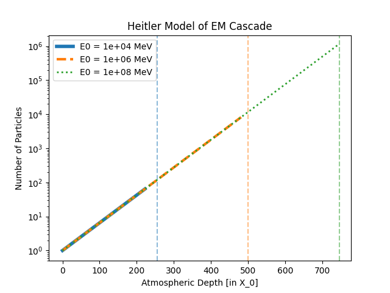
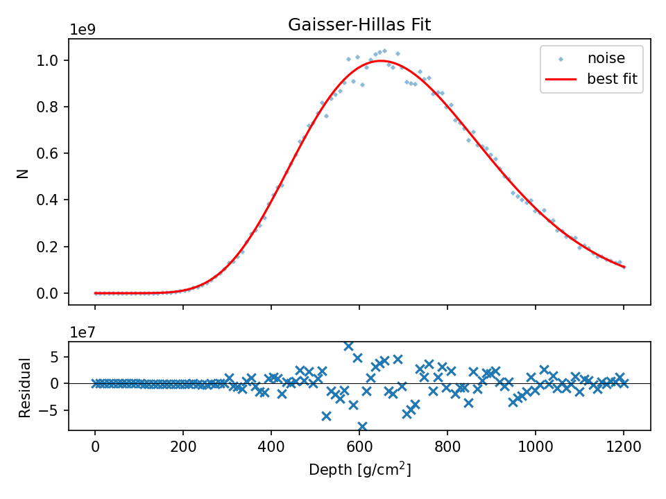
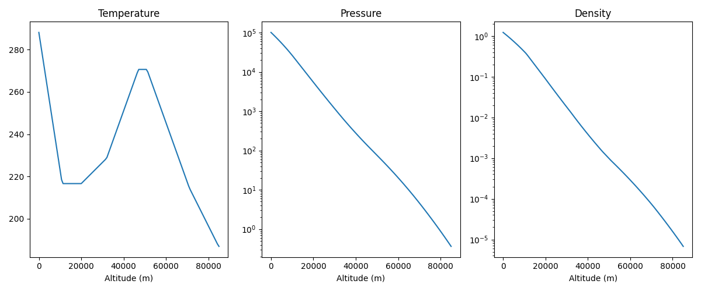
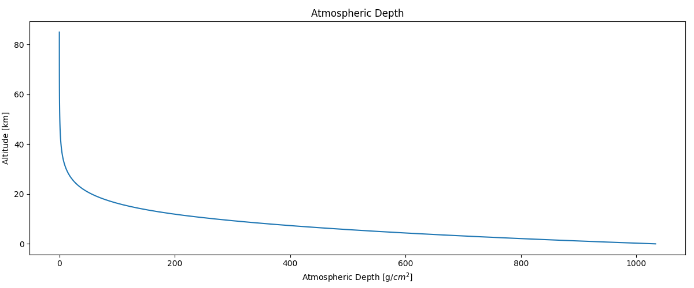
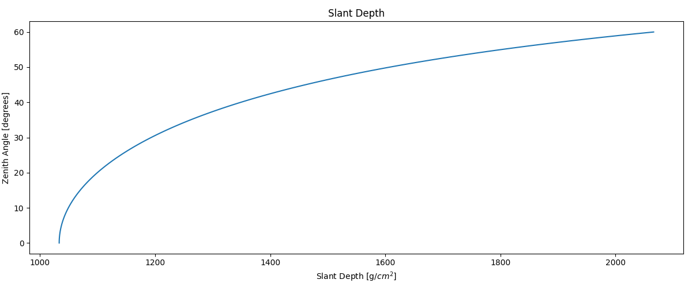
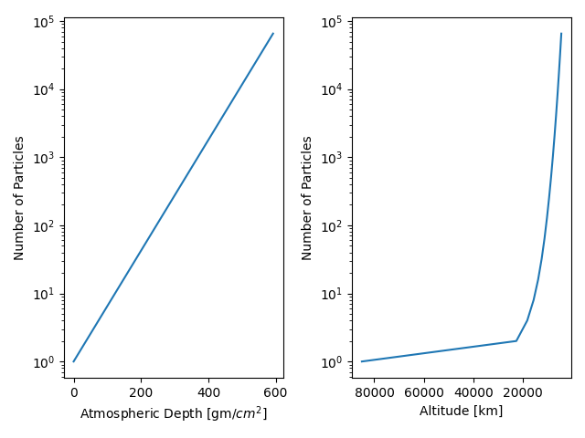

# Cosmic Ray Toolkit

This repo is for building out some of the basic calculations and computational physics to model a cosmic ray cascade in earth's atmosphere.

## Description

The project will include a simplified framework called the Heitler Toy Model to build out basic intuition of the cosmic ray cascade process and deliver fundamental physical takeaways that still hold true for modern iterations of cosmic ray cascade calculations. 

That intuition will be extended to the more complex models like the Gaisser-Hillas function - a model that more thoroughly details the particle interactions in a cosmic ray cascade. Monte Carlo methods will be employed to simulate many different cascades and compare those results to open-source cosmic ray data, like that from the Pierre Auger Obervatory in Argentina.

This project will include a implementation of the Standard Atmosphere calculation in which the cascades will occur, and then finally an analysis of the open source data from Pierre Auger. 

## Getting Started

### Dependencies

The program requirements can be found in requirements.txt and include:
 - numpy
 - scipy
 - matplotlib
 - pandas
 - jupyter

### Installing & Running

"```"
git clone https://github.com/cnseacrist/cosmic-ray-toolkit.git
cd cosmic-ray-toolkit
python -m venv .venv && source .venv/bin/activate
pip install -r requirements.txt
"```"
Run any project's script from `src/`, or launch the Project 5 notebook with `jupyter lab`.

### Executing program

The repo includes 5 projects:
 - Heitler Cascade Simulator
 - Gaisser-Hillas Profile Fitter
 - Atmospheric Depth Calculator
 - Cascade in a Realistic Atmosphere
 - Auger Open Data Analysis

### Project 1 - The Heitler Cascade Simulator

This program calculates the number of particles produced in the simplified Heitler model of an EM cascade of cosmic rays. It outputs a plot of how the number of particles produced varies with atmospheric depth for a few different selected energies. 

In the example figure, this was done for primary particle energies of 10^4, 10^6 and 10^8 MeV.



### Project 2 - The Gaisser-Hillas Profile Fitter

This calculates the gaisser-hillas equation for a set of shower parameters. Sample data is generated with random noise. We then find a best parameter fit, compare to expected values and calculate the elongation rate.



### Project 3 - Atmospheric Depth Calculator

The US Standard Atmosphere is modeled and functions are built to calculate the physical parameters of the atmosphere. Pressure, temperature and density functions allow a calculation of the atmospheric depth that is used in cascade processes in other parts of the project. These functions are imported and used throughout projects 4 and 5.





### Project 4 - Cascade in a Realistic Atmosphere

Combining our calculations from projects 1, 2, and 3 we are able to now model the cascade process in a realistic atmosphere and examine the cascade in terms of altitude as well as atmospheric depth.



### Project 5 - Auger Open Data Analysis

Armed with tools for the whole of the atmospheric particle cascade, we import summary CSV data from the Auger Open Source Data Project. We calculate the energy distribution, energy spectrum, X_max distribution, mean X_max vs. energy, and fit the Gaisser-Hillas function to data from observed events.

The full analysis is at [notebooks/auger_open_data.ipynb](file:///home/charlie/Downloads/auger_open_data.html)

## Authors

Contributors names and contact info:

Charles Seacrist
cnseacrist@gmail.com

## License

This project is licensed under the MIT License - see the LICENSE file for details.

## Data Citation

Pierre Auger Observatory Open Data, CC BY-SA 4.0.
DOI: [10.5281/zenodo.4487612](https://doi.org/10.5281/zenodo.4487612)
